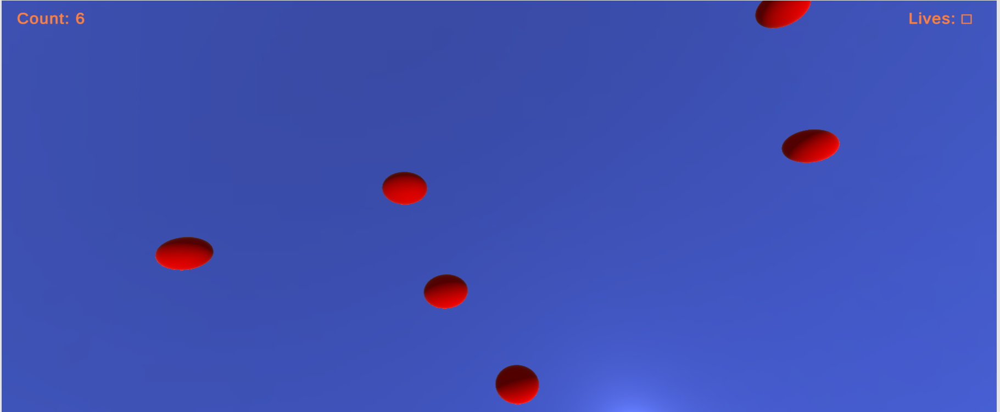

# 2D Counting Game

A simple counting game with music, effects, sound and balloons. You just to burst the balloons before they go above screen and increase your score.

## How to Run

It's published on itch.io, so you can play directly from there. Here is the [link](https://dsmeena.itch.io/balon-burst)

## Results

It's a beginer's project. The purpose of making this was to learn some concepts of Unity game development like adding effects, sounds, music, menu and physics.